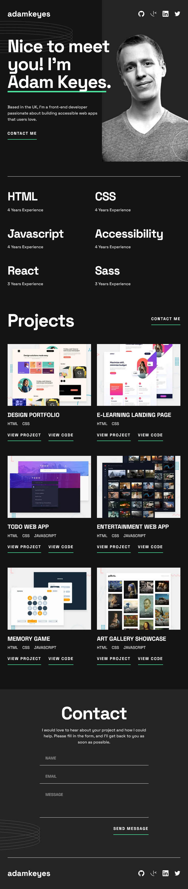
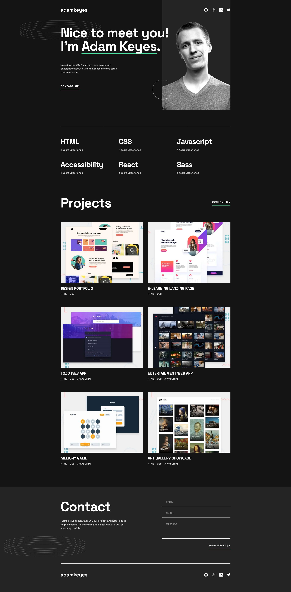

# Frontend Mentor - Single-page developer portfolio solution

This is a solution to the [Single-page developer portfolio challenge on Frontend Mentor](https://www.frontendmentor.io/challenges/singlepage-developer-portfolio-bBVj2ZPi-x). Frontend Mentor challenges help you improve your coding skills by building realistic projects.

## Links

- Solution URL: [FrontEnd Mentor Solution Page](https://your-solution-url.com)
- Live Site URL: [GitHub Pages Site](https://your-live-site-url.com)

## Built with

- Semantic HTML5 markup
- CSS custom properties
- CSS Grid
- Mobile-first workflow
- [Svelte](https://svelte.dev/)

## Author

- Frontend Mentor - [@karolbanat](https://www.frontendmentor.io/profile/karolbanat)

## Screenshot

